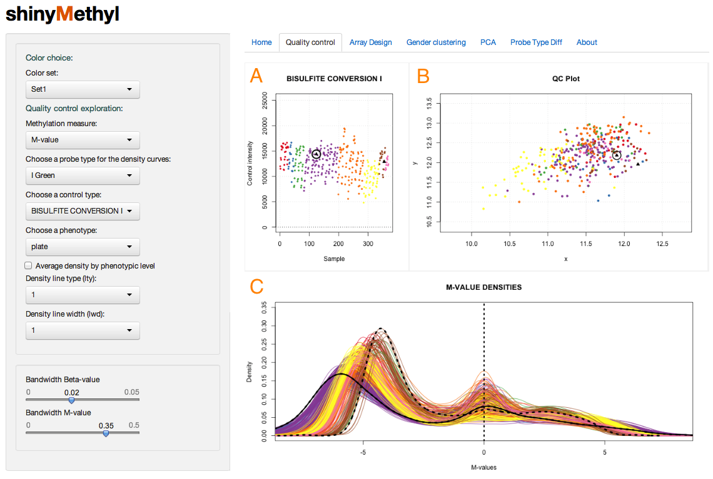
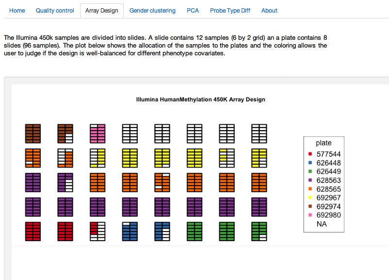
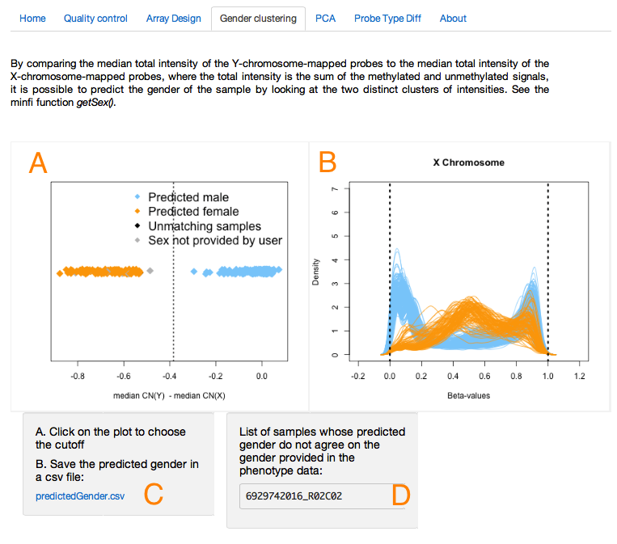
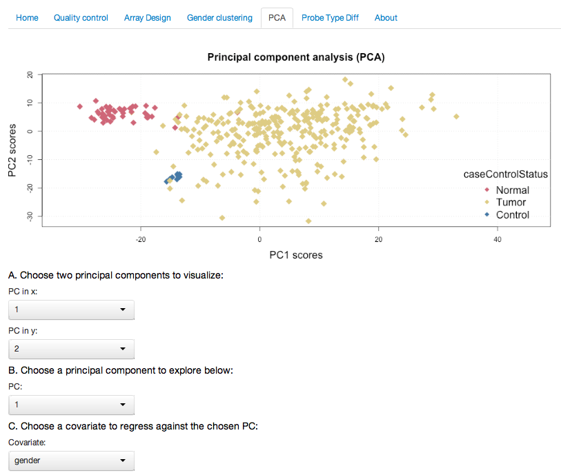
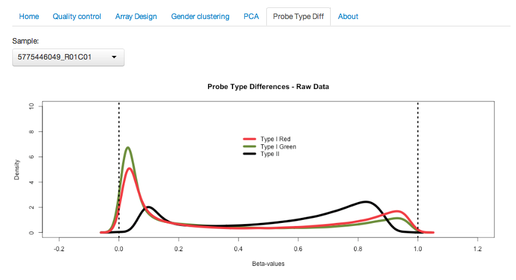
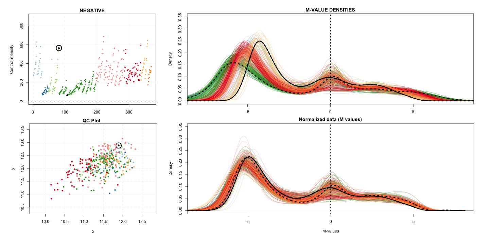
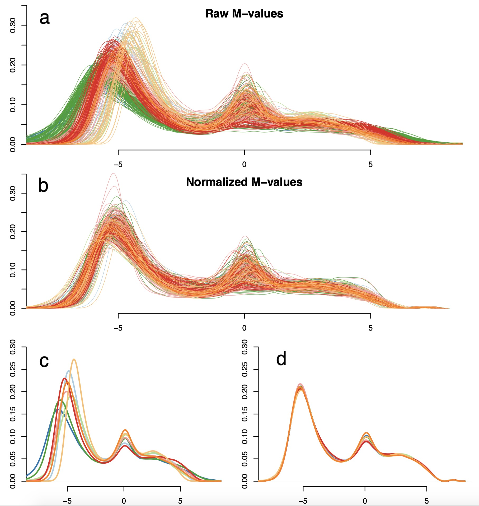
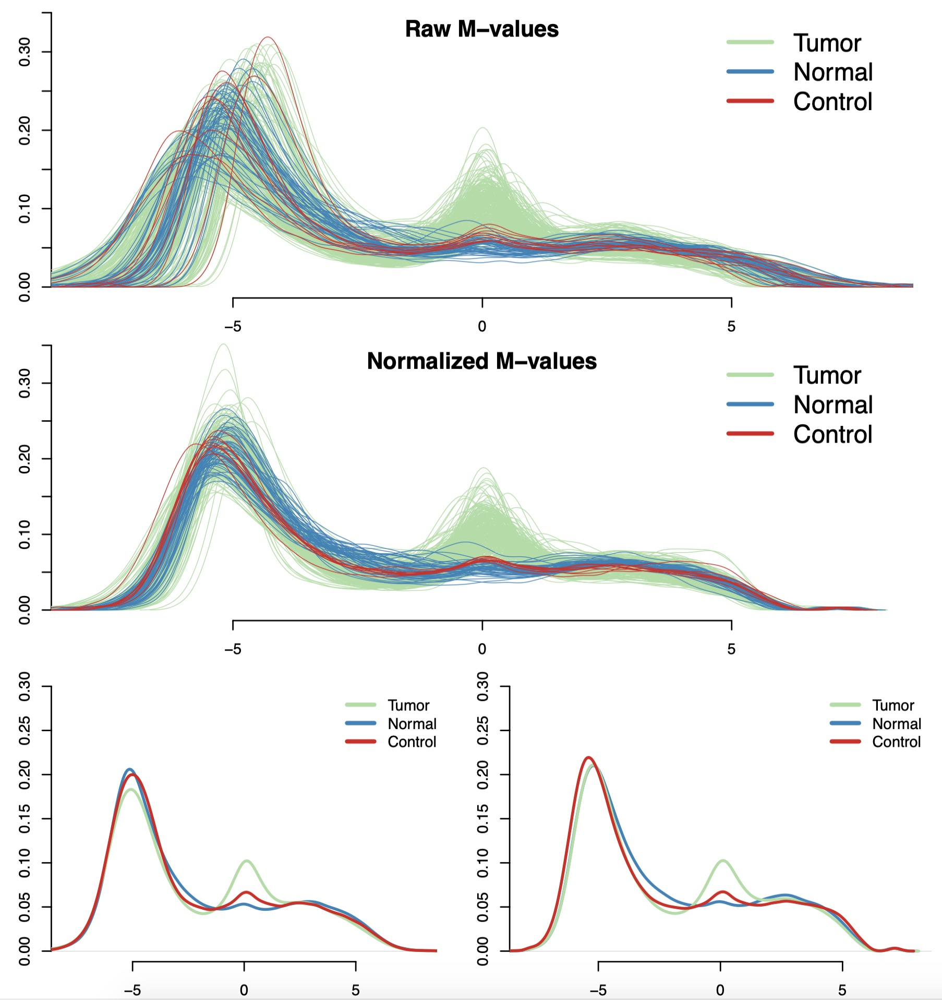

# Introduction

Up to now, more than 10,000 methylation samples from the state-of-the-art 
450K microarray have been made available through The Cancer Genome Atlas 
portal [@tcga] and the Gene Expression Omnibus (GEO) [@Geo]. 
Large-scale comparison studies, for instance between cancers or tissues,
become possible epigenome-widely. These large studies often require a  
substantial amount of time spent on preprocessing the data and performing
quality control. For such studies, it is not rare to encounter significant 
batch effects, and those can have a dramatic impact on the validity of the 
biological results [@batchreview], [@Harper:2013]. With that in mind, 
we developed `shinyMethyl` to make the preprocessing of large 450K
datasets intuitive, enjoyable and reproducible. `shinyMethyl`
is an interactive visualization tool for Illumina 450K methylation array 
data based on the packages `r BiocStyle::Biocpkg("minfi")` and
`r BiocStyle::CRANpkg("shiny")`.

A few mouse clicks allow the user to appreciate insightful 
biological inter-array differences on a large scale. The goal of
`shinyMethyl` is two-fold: (1) summarize a high-dimensional 450K
array experiment into an exportable small-sized R object and (2)
launch an interactive visualization tool for quality control assessment 
as well as exploration of global methylation patterns associated
with different phenotypes.


# Example dataset

To take a quick look at how the interactive interface of 
`shinyMethyl` works, we have included an example dataset in 
the companion package `r BiocStyle::Biocpkg("shinyMethylData")`. 
The dataset contains  the extracted data of 369 Head and Neck cancer 
samples downloaded from The
Cancer Genome Atlas (TCGA) data portal [@tcga]: 310 tumor samples, 
50 matched normals and 9 replicates of a control cell line. The 
first `shinyMethylSet` object (see Section 3 for the definition
of a `shinyMethylSet` object) was created from the raw data (no
normalization) and is stored under the name `summary.tcga.raw.rda`;
the second `shinyMethylSet` object was created from a 
`GenomicRatioSet` containing the normalized data and the file is stored 
under the name `summary.tcga.norm.rda`. The samples were normalized 
using functional normalization, a preprocessing procedure that we recently 
developed for heterogeneous methylation data [@funnorm].

To launch `shinyMethyl` with this TCGA dataset, simply
type the following commands in a fresh R session:


```{r, shinyMethylData, eval=FALSE}
library(shinyMethyl)
library(shinyMethylData)
runShinyMethyl(summary.tcga.raw, summary.tcga.norm)
```

The interactive interface will take a few seconds to be launched in 
your default HTML browser.

# Creating your own dataset visualization

In this section, we describe how to launch an interactive visualization for 
your methylation dataset. 

## Step 1: creating a RGChannelSet object with minfi

An `RGChannelSet` is an object defined in `minfi` containing 
the raw intensities of the green and red channels of your 450K experiment. 
To create an `RGChannelSet`, you will need to have the raw files of 
the experiment with extension .IDAT (we refer to those as .IDAT files). 
In case you do not have these files, you might want to ask your collaborators 
or your processing core if they have those. You absolutely need them to both
use the packages `minfi` and `shinyMethyl`. The vignette in
`minfi` describes carefully how to read the data in for different 
scenarios and how to construct an `RGChannelSet`. Here, we show a 
quick way to create an `RGChannelSet` from the .IDAT files 
contained in the package `minfiData`.

```{r, loadlibraries, eval=TRUE, results="hide",warning=FALSE,message=FALSE}
library(minfi)
library(minfiData)
```

We need to tell R which directory contains the .IDAT files and the 
experiment sheet: 

```{r, basedir,eval=FALSE}
baseDir <- system.file("extdata", package = "minfiData")
# baseDir <- "/home/yourDirectoryPath" 
```

We also need to read in the experiment sheet:

```{r, experimentsheet,eval=FALSE}
targets <- read.450k.sheet(baseDir)
head(targets)
```

Finally, we construct the `RGChannelSet` using `read.450k.exp`:

```{r, rgsetconstruction,eval=FALSE}
RGSet <- read.450k.exp(base = baseDir, targets = targets)
```

The function `pData` in `minfi` allows to see the phenotype 
data of the samples:

```{r, phenotype, eval=FALSE}
pd <- pData(RGSet)
head(pd)
```

## Step 2: creating a shinyMethylSet object

From the `RGChannelSet` created in the
previous section, we create a `shinyMethylSet` by using the command
`shinySummarize`

```{r, summarize, eval=FALSE}
myShinyMethylSet <- shinySummarize(RGSet)
```

This is a small object containing all of the necessary information
extracted from a RGChannelSet to launch shinyMethyl. 


## Step 3: launching the interactive shiny interface

To launch a `shinyMethyl` session, simply pass your 
`shinyMethylSet` object to the `runShinyMethyl` function 
as follows:

```{r, sessionLaunching, eval=FALSE}
runShinyMethyl(myShinyMethylSet)
```

# How to use the different \Biocpkg{shinyMethyl} panels

The different figures at the end of the vignette explain how to use each of the `shinyMethyl` panels.

# Advanced option: visualization of normalized data

`shinyMethyl` also offers the possibility to visualize normalized 
data that are stored in a `GenomicRatioSet` object. For instance, 
suppose we normalize the data by using the quantile normalization algorithm
implemented in `minfi` (this function returns a `GenomicRatioSet`
object by default):

```{r, normalize, eval=FALSE}
GRSet.norm <- preprocessQuantile(RGSet)
```

We can then create two separate `shinyMethylSet` objects corresponding 
to the raw and normalized data respectively:

```{r, summarizeNorm,eval=FALSE}
summary   <- shinySummarize(RGSset)
summary.norm <- shinySummarize(GRSet.norm)
```

To launch the `shinyMethyl` interface, use `runShinyMethyl` with 
the first argument being the `shinyMethylSet` extracted from the raw data
and the second argument being the `shinyMethylSet` extracted from the 
data as follows:

```{r, runshiny,eval=FALSE}
runShinyMethyl(summary, summary.norm)
```

# What does a shinyMethylSet contain?

A `shinyMethylSet` object contains several summary data from a 450K 
experiment: the names of the samples, a data frame for the phenotype, a 
list of quantiles for the M and Beta values, a list of quantiles for the
methylated and unmethylated channels intensities and a list of quantiles
for the copy numbers, the green and red intensities of different control
probes, and the principal component analysis (PCA) results performed on the 
Beta values. One can access the different summaries by using the slot
operator `@`. The slot names can be obtained with the function
`slotNames` as follows:

```{r, eval=TRUE,warning=FALSE,message=FALSE}
library(shinyMethyl)
library(shinyMethylData)
slotNames(summary.tcga.raw)
```

For instance, one can retrieve the phenotype by
```{r, pheno,eval=TRUE}
head(summary.tcga.raw@phenotype)
```

`shinyMethyl` also contain different accessor functions to 
access the slots. Please see the manual for more information.


# Figures

## Quality control figure

This is an example of interactive visualization and quality control assessment.
The three plots react simultaneously to the user mouse clicks and selected 
samples are represented in black. In this scenario, colors represent batch, 
but colors can be chosen to reflect the phenotype of the samples as well via 
the left-hand-side panel. The three different plots are: A) Plot of the quality
controls probes reacting to the left-hand-side panel; the current plot shows 
the bisulfite conversion probes intensities. B) Quality control plot as
implemented in `minfi`:  the median intensity of the M channel against the
median intensity of the U channel. Samples with bad quality would cluster 
away from the cloud shown in the current plot. For this dataset, all samples
look good. C) Densities of the methylation intensities (can be chosen to be 
Beta-values or M-values, and can be chosen by probe type). The current plot 
shows the M-value densities for Infinium I probes, for the raw data. 
The dashed and solid lines in black correspond to the two samples selected
by the user and match to the dots circled in black in the left-hand plots. 
The left-hand-side panel allows users to select different tuning parameters 
for the plots, as well as different phenotypes for the colors. The user can
click on the samples that seem to have low quality, and can download the 
names of the samples in a csv file for further analysis 
(not shown in the screenshot).}

```{r, echo=FALSE}

```


## Array design panel

The plot represents the physical slides (6 x 2 samples) on which the samples 
were assayed in the machine. The user can select the phenotype to color 
the samples. This plot allows to explore the quality of the randomization 
of the samples for a given phenotype.

```{r, echo=FALSE}

```

## Sex prediction algorithm panel

The difference of the median copy number intensity for the Y chromosome and
the median copy number intensity for the X chromosome can be used to separate
males and females. In A), the user can select the vertical cutoff (dashed line)
manually with the mouse to separate the two clusters (orange for females, 
blue for males). Corresponding Beta-value densities appear in B) for further
validation. The predicted sex can be downloaded in a csv file in C), and 
samples for which the predicted sex differs from the sex provided in the
phenotype will appear in D).

```{r, echo=FALSE}

```

## Principal Component Analysis (PCA)

Users can select the principal components to visualize (PC1 and PC2 are shown 
in the current plot) and can choose the phenotype for the coloring. 
In the present plot, one can observe that the first two principal 
components distinguish tumor samples from normal samples for the TCGA 
example dataset (see example dataset section).

```{r, echo=FALSE}

```

## Type I/II probe bias

The distributional differences between the Type I and Type II probes can be
observed for each sample (selected by the user).


```{r, echo=FALSE}

```

## Comparison of raw and normalized data


As discussed in the Advanced option, normalized data can be added as well 
to the visualization interface. In the present plot, the top plot at the 
right shows the raw densities while the bottom plot shows the densities
after functional normalization [@funnorm].

```{r, echo=FALSE}

```

## Visualization of batch effects in the TCGA HNSCC dataset

In the first two plots are shown the densities of the M-values for Type I green 
probes before and after functional normalization [@funnorm].
Each curve represents one sample and different colors represent different
batches. The last two plots show the average density for each plate 
before and after normalization. One can observe that functional 
normalization removed significantly global batch effects.
  
```{r, echo=FALSE}

```


## Visualization of cancer/normal differences in the TCGA HNSCC dataset

In the first two plots are shown the densities of the M-values for Type I
green probes before (a) and after (b) functional normalization [@funnorm].
Green and blue densities represent tumor and normal samples respectively, and 
red densities represent 9 technical replicates of a control cell line. 
The last two plots show the average density for each sample group before 
and after normalization. Functional normalization preserves the expected
marginal differences between normal and cancer, while reducing the
variation between the technical controls (red lines).
  
```{r, echo=FALSE}

```


# Session info

Here is the output of `sessionInfo` on the system on which
this document was compiled:

```{r, sessionInfo}
sessionInfo()
```

# References


